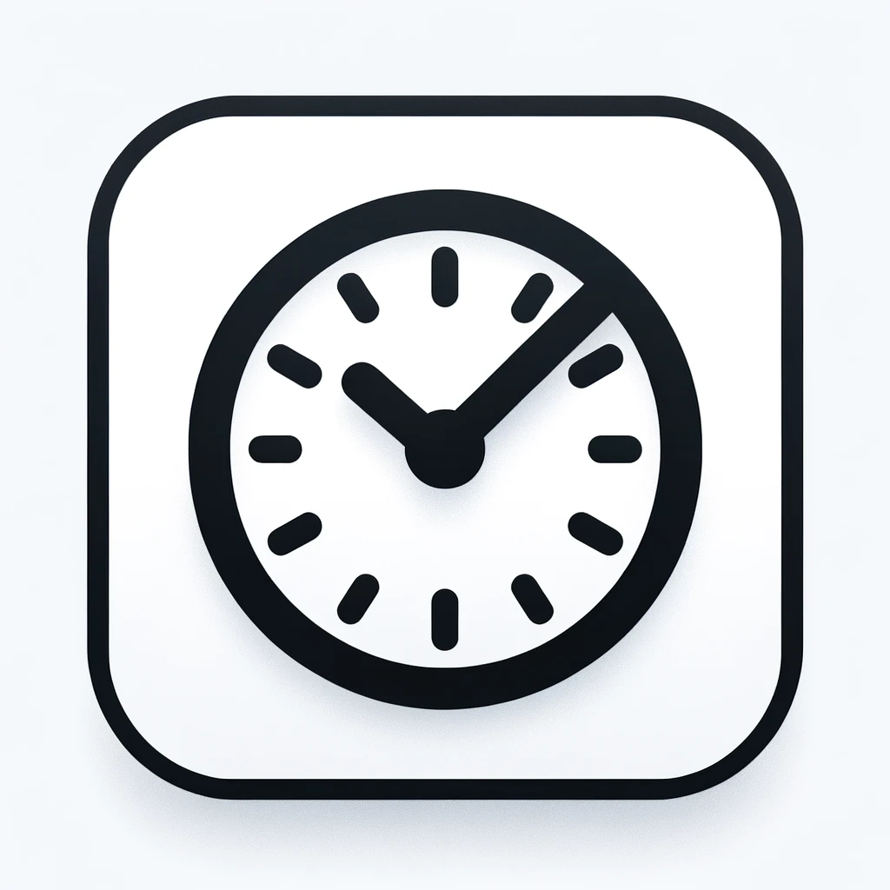

# Page Load Timer Extension



Page Load Timer is a simple Chrome extension that helps you manage your time spent on web pages. It monitors the amount of time you spend on a web page and notifies you after a specified period. The extension provides options to close the tab or extend the time.

## Features

- **Time Tracking**: Automatically starts tracking the time you spend on a web page.
- **Notifications**: Alerts you when you have spent 10 minutes on a page.
- **Actions**: Options to close the tab or add more time.
- **Active Tab Only**: Only tracks time when the tab is active.

## Installation

1. Clone or download the repository:
    ```sh
    git clone https://github.com/yourusername/productivity-extension.git
    ```
2. Open Google Chrome and navigate to `chrome://extensions/`.
3. Enable **Developer mode** by toggling the switch in the top right corner.
4. Click **Load unpacked** and select the directory where you cloned or downloaded the repository.

## Usage

1. Open a web page in Chrome.
2. The extension will automatically start tracking the time.
3. After 10 minutes, a popup will appear with the following options:
   - **OK**: Close the current tab.
   - **Add another 10 minutes**: Close the popup and extend the timer by 10 minutes.

## Development

### Prerequisites

- [Node.js](https://nodejs.org/) (for development dependencies and tools)

### Build

1. Install dependencies:
    ```sh
    npm install
    ```
2. Build the project:
    ```sh
    npm run build
    ```

## Contributing

Contributions are welcome! Please follow these steps to contribute:

1. Fork the repository.
2. Create a new branch: `git checkout -b feature/your-feature-name`.
3. Make your changes and commit them: `git commit -m 'Add some feature'`.
4. Push to the branch: `git push origin feature/your-feature-name`.
5. Open a pull request.

## License

This project is licensed under the MIT License - see the [LICENSE](LICENSE) file for details.

## Acknowledgements

- [Google Chrome Extensions Documentation](https://developer.chrome.com/docs/extensions/mv3/)
- [Awesome README Templates](https://github.com/matiassingers/awesome-readme)

## Contact

For any inquiries, please contact [mikel.ugarte@biartechnology.com](mailto:mikel.ugarte@biartechnology.com).

